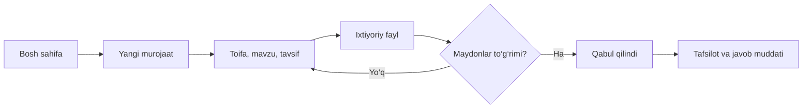
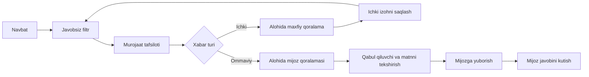
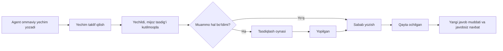

# Axborot tuzilmasi va oqimlar

## Tuzilma
Agent: Bosh sahifa → Murojaatlar → Tafsilot → Javob / Ichki izoh / Ustuvorlik / Mas’ul / Yechim.
Agent yordamchi bo‘limlari: Javobsiz murojaatlar, Hisobotlar, Jamoa, Bilimlar bazasi, SLA qoidalari.
Mijoz: Bosh sahifa → Murojaatlarim / Yangi murojaat / Yordam / Yangiliklar.
Loyiha: ekranlar xaritasi, hujjatlar, UI kit, oldin-keyin.

## Mijoz yangi murojaati

## Agent javobi

## Yechim va qayta ochish

Holatlar: Yangi → Jarayonda → Yechildi → Yopilgan. Yechildi yoki Yopilgan → Qayta ochilgan → Jarayonda.
Mijoz oxirgi ommaviy xabarni yuborganda javobsiz hisoblanadi. Ichki izoh va holat voqealari bu hisobni o‘zgartirmaydi. Yechildi va Yopilgan aktiv navbatdagi javobsiz filtrga kirmaydi.

